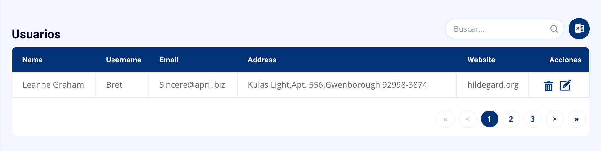

# Frontend Jr Challenge 

Este es el challenge de frontend de Tecnoandina SPA.

# Tarea 1: Prueba de diseño

Hacer la maqueta en HTML y CSS para la tabla mostrada abajo. Se permite usar cualquier biblioteca CSS.

# Tarea 2: Prueba de programación

- Se debe hacer una petición HTTP al endpoint https://jsonplaceholder.typicode.com/users y llenar la tabla anterior con los datos devueltos. Para la columna `address` se deberán concatenar las propiedades `street`, `suite`, `city` y `zipcode` del objeto `user.address` devuelto por el endoint.
- Los registros deben mostrarse ordenados por su propiedad `name`.
- Si la última letra de `name` se encuentra antes de la letra `m` la fila debe pintarse con el color `#7faee3`.
- Se debe permitir la eliminación de los registros.
- Se debe permitir la edición de los registros. Es suficiente con actualizar las propiedades `name`, `username`, `email` y `website`. La interfaz de usuario para editar los datos queda a su discreción.
- La eliminación y actualización se harán en los datos en memoria, no es necesario llamar ningún endpoint.

## Consideraciones

- No es necesario implementar la búsqueda ni la paginación. Será un extra si se hace.
- Puede usar cualquier framework o biblioteca para el desarrollo. Aunque preferimos ReactJS.
- Se tomarán en cuenta las buenas prácticas de programación.

## Entrega

- Tienes 7 días para resolverlo contando desde el dia que recibiste el mail con este link. Debes resolverlo y subirlo a un repositorio publico de github/gitlab/etc. Luego debes enviar el link del repositorio a la persona que te envio este link.
- Cualquier duda o consulta que tengas la puedes hacer por mail.